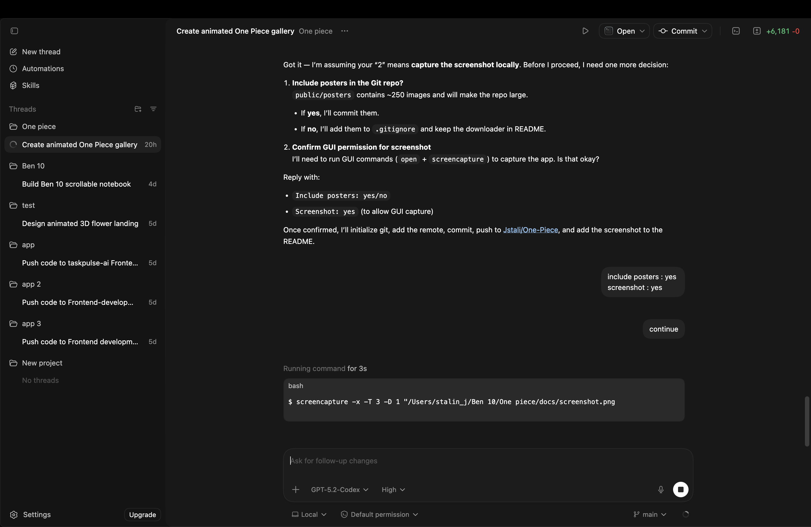

# One Piece Wanted Poster Notebook

A single-page React notebook that showcases **all One Piece wanted posters** in a cinematic, 3D tilt gallery. Posters are stored locally and displayed in a dense, beautiful grid with fast search and a detailed info modal.



## Features
- All wanted posters stored locally in `public/posters`
- 3D tilt interactions and layered paper textures
- Fast search by character name
- Click any poster for details (crew, bounty, status, etc.)

## Setup
```bash
npm install
npm run dev
```

## Scripts
```bash
npm run download:posters   # Download all posters into public/posters
npm run dedupe:posters     # Remove duplicate poster images
npm run enrich:posters     # Fetch character info to fill poster details
```

## Notes
- `enrich:posters` pulls info from the One Piece Wiki infoboxes.
- Posters are already included in this repo; you can re-download if you want the latest set.
